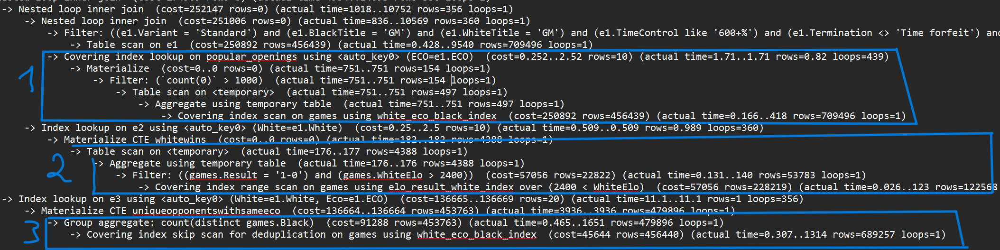

# Hints. Step 3

USE INDEX - пропонує використати вказаний індекс. В прикладі замість ```elo_result_white_index``` MySQL вибрав ```white_eco_black_index```. Весь запит тривав 190 секунд.

```
WhiteWins as (
		select
			count(*) as white_eco_black_index,
			White
		from games use index ()
		where
			WhiteElo > 2400
	        AND Result = '1-0'
	    group by White
)
```

```
-> Filter: ((games.Result = '1-0') and (games.WhiteElo > 2400))  (cost=250892 rows=15213) (actual time=44.7..176637 rows=53783 loops=1) 
	-> Index scan on games using white_eco_black_index  (cost=250892 rows=456439) (actual time=0.754..175390 rows=709496 loops=1)
```


FORCE INDEX - задає конкретно певний індекс.

```
WhiteWins as (
		select
			count(*) as WhiteWins,
			White
		from games force index (white_eco_black_index)
		where
			WhiteElo > 2400
	        AND Result = '1-0'
	    group by White
)
```

```
-> Filter: ((games.Result = '1-0') and (games.WhiteElo > 2400))  (cost=502084 rows=15213) (actual time=95.9..180800 rows=53783 loops=1)
	-> Index scan on games using white_eco_black_index  (cost=502084 rows=456439) (actual time=10.5..179260 rows=709496 loops=1)

```

STRAIGHT_JOIN - Змушує виконувати запити в тому порядку, в якому вказано в скрипті. В прикладі час виконання майже не змінився

```
join (
    select ECO
    from games
    group by ECO
    having count(*) > 1000
) popular_openings ON e1.ECO = popular_openings.ECO

join WhiteWins e2
	on e1.White = e2.White

join UniqueOpponentsWithSameECO e3
	on e1.White = e3.White and
		e1.ECO = e3.ECO
```



## Необхідність та переваги використання hints
Може бути корисним коли ми знаєм краще, який індекс використовувати, ніж MySQL.
Наприклад були моменти в файлі explain analyze, коли очікуваний результат відрізнявся від актуального.
Це в свою чергу впливає на вибір MySQL потрібного індексу, або порядок виконання під запитів.